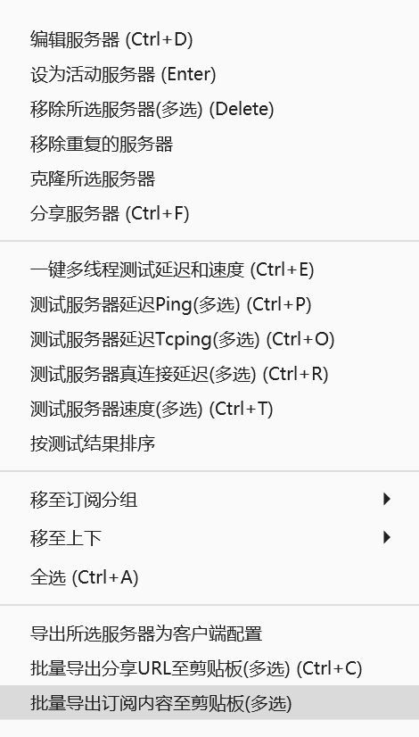

- [1. Introduction](#1-introduction)
- [2. VPS](#2-vps)
- [3. Cloudflare Warp](#3-cloudflare-warp)
  - [3.1. Install](#31-install)
  - [3.2. Usage](#32-usage)
- [4. V2ray](#4-v2ray)
  - [4.1. Install](#41-install)
  - [4.2. Speed Booster (not necessary)](#42-speed-booster-not-necessary)
  - [4.3. Usage](#43-usage)
  - [4.4. Config](#44-config)
- [5. subscription](#5-subscription)
  - [5.1. create web server on VPS](#51-create-web-server-on-vps)
    - [5.1.1. install](#511-install)
    - [5.1.2. config](#512-config)
    - [5.1.3. check syntax and restart nginx](#513-check-syntax-and-restart-nginx)
  - [5.2. export config from V2ray](#52-export-config-from-v2ray)
  - [5.3. subscription url](#53-subscription-url)
- [6. Note](#6-note)
# 1. Introduction

[Reference](https://github.com/Alvin9999/new-pac)

Guide to build a proxy server with VPS and Cloudfare warp.

A VPS is the core of a proxy server. For most cases (eg. Youtube), VPS is enough to cross over GFW. Websites like ChatGPT and Netflix will block famous ISP, in which case raw IP is needed. That's why warp is used here and Cloudfare is a free one and easy to deploy thanks to out-of-box shell scripts. To make life easier, we create a subscription link to share with others.


# 2. VPS

1. Buy a VPS (LA and Debian Operating System is preferred)
   [Vultr](https://www.vultr.com/)

2. Deploy server (Bitvise is recommended)

# 3. Cloudflare Warp

## 3.1. Install

[Cloudflare WARP Installer](https://github.com/P3TERX/warp.sh)

```sh
# use warp without downloading
bash <(curl -fsSL git.io/warp.sh) [SUBCOMMAND]
# or download and use it locally
wget git.io/warp.sh
bash warp.sh [SUBCOMMAND]
```

## 3.2. Usage

```sh
# IPv6 is preferred, because IPv4 is used by a lot of people. There is a high possibility that it is banned by some websites.
bash warp.sh wg6
```

# 4. [V2ray](https://www.v2ray.com/)

## 4.1. Install

```sh
source <(curl -sL https://multi.netlify.app/v2ray.sh) --zh
```

## 4.2. Speed Booster (not necessary)

1. install

```sh
wget -N --no-check-certificate "https://raw.githubusercontent.com/chiakge/Linux-NetSpeed/master/tcp.sh"

chmod +x tcp.sh

./tcp.sh
```

2. open bbr

```sh
# BBR as an example
bash tcp.sh 4
```

## 4.3. Usage

```
v2ray
3: change v2ray settings automatically (or change it from config file)
4: get vmess link
```

## 4.4. Config

location: /etc/v2ray/config.json

```json
{
  "log": {
    "access": "/var/log/v2ray/access.log",
    "error": "/var/log/v2ray/error.log",
    "loglevel": "info"
  },
  // v2ray general settings, generated automatically by V2ray
  "inbounds": [],
  // outbonds rules
  "outbounds": [
    {
      "protocol": "freedom",
      "settings": {}
    },
    {
      "protocol": "blackhole",
      "settings": {},
      "tag": "block"
    },
    // socks warp for IPv4, not used in this case, just for notes
    {
      "protocol": "socks",
      "tag": "warp",
      "settings": {
        "servers": [
          {
            "address": "127.0.0.1",
            "port": 40000,
            "users": []
          }
        ]
      }
    },
    //  Strategy for domain name resolution. Options are:
    // "AsIs": Default value. Resolve domain name by system.
    // "UseIP": Use internal DNS for domain name resolution.
    // "UseIPv4": Use IPv4 address only, after resolved by internal DNS.
    // "UseIPv6": Use IPv6 address only, after resolved by internal DNS.
    {
      "tag": "IP6_out",
      "protocol": "freedom",
      "settings": {
        "domainStrategy": "UseIPv6"
      }
    }
  ],
  "routing": {
    "rules": [
      {
        "type": "field",
        "ip": [
          "0.0.0.0/8",
          "10.0.0.0/8",
          "100.64.0.0/10",
          "169.254.0.0/16",
          "172.16.0.0/12",
          "192.0.0.0/24",
          "192.0.2.0/24",
          "192.168.0.0/16",
          "198.18.0.0/15",
          "198.51.100.0/24",
          "203.0.113.0/24",
          "::1/128",
          "fc00::/7",
          "fe80::/10"
        ],
        "outboundTag": "block"
      },
      // Domains are specified here since warp may slow your network speed and you do not want all connections get through warp
      {
        "type": "field",
        "domain": ["openai.com", "ai.com", "netflix.com"],
        "outboundTag": "IP6_out"
      }
    ]
  }
}
```

# 5. subscription

## 5.1. create web server on VPS
### 5.1.1. install
```sh
apt -y install nginx
```
### 5.1.2. config
```sh
vi /etc/nginx/nginx.conf
```
```nginx
user www-data;
worker_processes 2;
pid /run/nginx.pid;
 
error_log /var/log/nginx/error.log;
include /usr/share/nginx/modules/*.conf;
events {
    worker_connections 1024;
}
 
http {
    log_format  main  '$remote_addr - $remote_user [$time_local] "$request" '
                      '$status $body_bytes_sent "$http_referer" '
                      '"$http_user_agent" "$http_x_forwarded_for"';
proxy_cache_path /etc/nginx/cache levels=1:2 keys_zone=cache_one:200m inactive=1d max_size=512m;
    access_log  /var/log/nginx/access.log  main;
    sendfile            on;
    tcp_nopush          on;
    tcp_nodelay         on;
    keepalive_timeout   65;
    types_hash_max_size 2048;
    include             /etc/nginx/mime.types;
    default_type        application/octet-stream;
    #include /etc/nginx/conf.d/*.conf;
    server {
        listen       18907;  #指定端口，访问的时候需要，推荐五位端口
        root   /usr/share/nginx/html ;
        proxy_cache_key  $host$uri;
        proxy_set_header  Host  $host;
        proxy_set_header    X-real-ip $remote_addr;
        proxy_set_header  X-Forwarded-For  $remote_addr;
        location / {
              root /etc/nginx/download;   # 指定实际目录绝对路径
              autoindex on;                   # 开启目录浏览功能
              autoindex_exact_size off;       # 关闭详细文件大小统计，让文件大小显示MB，GB单位，默认为b
              autoindex_localtime on;         # 开启以服务器本地时区显示文件修改日期
              charset utf-8,gbk;              # 显示中文
              #limit_conn one 8;              # 并发数配置
              #limit_rate 100k;               # 单线程最大下载速度kb
       }
    }
}
```
### 5.1.3. check syntax and restart nginx
```sh
nginx -t && systemctl restart nginx
```

## 5.2. export config from V2ray

Paste the config to file `sub` and put the file under `/etc/nginx/download/sub`

## 5.3. subscription url
```http
http://<your server>:<port>/sub
```

# 6. Note

1. VPS needs to restart every month
2. warp server has to open manually after VPS restarts
